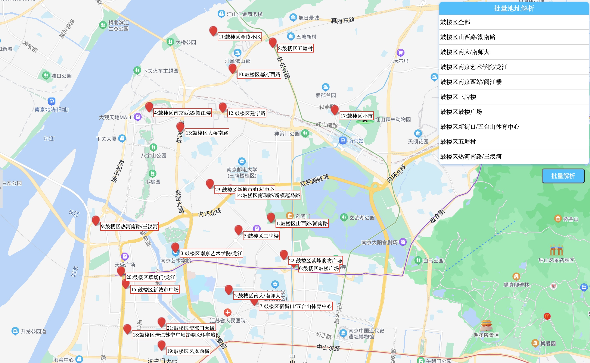

# 美团 ™ 爬虫练习项目

> 彼窃钩者诛，窃国者为诸侯 --《庄子·胠箧》

- 本项目（代码）仅供学习交流，请勿将数据以任何方式、任何形式、直接或者间接地（脱敏、清洗、解析）商用。
- 本项目（代码）仅供学习交流，请勿将数据转给第三方盈利。

## 预览

1. [特性](#1-特性)
2. [用例](#2-用例)
3. [设计](#3-设计)
   1. [技术调研](#31-技术调研)
   2. [工作原理](#32-工作原理)
   3. [服务](#33-服务)
   4. [环境](#34-环境)
4. [数据](#4-数据)
   1. [目录结构](#41-目录结构)
   2. [POI](#42-poi)
   3. [POI 说明](#43-poi-说明)
   4. [POI 分布](#44-poi-分布)
5. [性能](#5-性能)
6. [法律](#6-法律)
   1. [数据使用](#61-数据使用)
   2. [技术实现](#62-技术实现)
   3. [相关法律](#63-相关法律)
   4. [法律链接](#64-法律链接)
7. [遗留](#7-遗留)
8. [注解](#8-注解)

## 1. 特性

- 从 [美团网](https://www.meituan.com/) 中获取 POI（城市、区域、子区域）列表数据
- 根据子区域
- 通过店铺编号抓取店铺（店名、编号、营销策略、配送服务、公告）数据
- 商品数据（商品名、价格、月销量、活动）

## 2. 用例

```bash
# clone
git clone https://github.com/guocaoyi/meituan-reptile-study ./reptile-study
cd ./reptile-study

# install & run
yarn
yarn run study --city=南京 --area=江宁区 --subArea=东山镇 --limit=100 --output=./output.json

# input your phone sms code
$ sms xxxxxx # contining
```

```bash
# opttion descriptions
examine the history and state (see also: git help revisions)
   pagenum            pageNum, pageSize = 20
   limit              Sh
   singletonTime      singleton time gap
   timeout            task timeout

```

## 3 设计

### 3.1 技术调研

#### 3.1.1 整体策略 & 优缺点对比

1. Web 端
   - 方案：
     1. 基于 Puppeteer 无头浏览器的页面抓取
     2. 基于 Cypress 等端对端测试框架的页面抓取
   - 优点：
     - 请求链路短、系统复杂度低
     - 无头浏览器，机器成本低；一台主机可同时运行多个进程（以 2C4G 为栗子，可以跑 10-15 个）
   - 缺点：
     - 短信验证码需要外部的接码平台介入（接码平台是违法业务）
     - Web 鉴权较严，破解成本高（滚动条、图形验证码）
     - 部分网页使用了 Font 来处理关键字段（name \ price），破解成本高
2. App 端
   - 方案：
     1. Appium 远程控制
     2. Appium 远程控制 + Charles 代理
     3. Appium 远程控制 + Proxyman CLI
   - 优点：
     - 系统稳定性好（会话登录，可以通过远程控制来模拟）
     - 自动化程度高
     - 配合代理可以获得完整数据
   - 缺点：
     - 请求链路较长、系统复杂度高
     - 需要提供额外的物理机器（安卓、iPhone）作为任务执行机器
     - 需要提供额外的物理主机（Mac、Win）作为远程控制端
     - APP UI 不可预测（活动弹窗、广告、引流）

### 3.2 工作原理

#### 3.2.1 主要阶段

- 省市区信息查询 POI 阶段：该阶段可以一次性获取，阶段性同步（1 次/月-季）
- 地址逆解析阶段
- DOM 抓取、解析、提取数据阶段

#### 3.2.2 流程

- POI 数据获取流程：
  开始 ->
  访问美团城市列表页（获取 DOM 内容） ->
  查询城市区域以及子区域（商业 POI） ->
  逆解析兴趣点地理信息 ->
  写入文件（按城市独立一份文件） ->
  结束
- 地址解析流程：
  开始 ->
  结束
- 店铺&商品数据获取流程：
  开始 ->
  输入省市区、品类 ->
  查询县区内兴趣点 ->
  逆解析兴趣点地理信息 ->
  压入队列 ->
  进入美团 H5 页面 ->
  配置定位 ->
  抓取店铺数据 & 店铺数据 ->
  结束

### 3.3 服务

> 本服务类型为脚本服务，仅一个 Node 服务且在执行任务时运行
> 内置： Web Wrapper（puppeteer）、队列（node-queue）、集群（cluster）

### 3.4 环境

- Account x N
- Phone Number（可用个人手机替代；接码业务在大陆境内为非法业务）
  - tel: 130xxxxxxxx
- LBS（[lbs.baidu.com](https://lbs.baidu.com/)）
  - appId: xxxxxxxx
  - appKey: xxxxxxxx
- Host: Linux 2C4G x 1
- Node: 14.18.0+
- Proxy IP x N

## 4. 数据

### 4.1 目录结构

```bash
# ./output
.
├── goods
│   ├── xxxx.json #
│   ...
├── pois
│   ├── xxxx.json #
│   ...
└── stores
    ├── xx市xxx区xx街道_wm_td.json # 单次任务爬完的数据结果（POI附近的店铺）
    ...
```

`xx市xxx区xx街道_wm_td.json` 格式为 `xx市xxx区xx街道_{type}_{subType}.json`

### 4.2 POI

> 本项目中的 POI 特指美团商业兴趣点
>
> 中国目前地级市 293 个、县级行政区 2844 个；其中所有地级市（包括县级单位）没有重名的；市辖区有重名但不单立
>
> 美团城市现为：1205 个（2022.08.10）；area 总数在 8000+；street 总数 30000+
>
> street poi 是单次任务的最小粒度（通过 street 查询附近店铺以及店铺数据）

### 4.3 POI 说明

美团城市既不是严格意义上的行政区域划分（即市辖区、县级市、区县），也不是市辖区整体划分；所以一切以美团的城市划分为准（且可能有重复）

- 北京为例，在美团城市中有 2 个（非正常划分，包含且单立）：北京（市辖区，且包含了门头沟区）、门头沟区
- 苏州为例，在美团城市中有 6 个（非正常划分，分拆了旅游景区）：即苏州（市区）、常熟、太仓、昆山、张家港、周庄（昆山下辖镇）
- 扬州为例，在美团城市中有 5 个（非正常划分，分拆了市辖区）：扬州（市区）、江都（市辖区，仍然以县级市单立）、高邮（县级市）、仪征（县级市）、宝应
- 阿拉善盟为例，直接划分整区 1 个（非正常划分，合并了所有县区）：阿拉善盟（左旗、右旗、额济纳旗）

过滤

- 香港、澳门、台湾、冥王星、垦丁等地，因美团并未实际运营，故过滤
- 过滤区县级以下的城市如（周庄、企石镇、东坑镇、乌镇、谢岗镇）

### 4.4 POI 分布

以美团「南京 > 鼓楼区」为例；可以看到 POI 的分布不是均匀的，距离间隔在 1 - 3 公里不等；所以在搜索店铺时，需要按照距离进行筛选


## 5. 性能

## 6. 法律

### 6.1 数据使用

- 本项目（代码）不直接提供数据（仅保留几千条数据供验证程序运行结果验证），仅提供部分技术实现逻辑；
- 本项目（代码）只获取公开数据（属于所有美团用户可以获得的数据）；
- 本项目（代码）只获取店铺、店铺活动、店铺商品等信息，不包含个人实名信息等敏感信息；
- 本项目（代码）并无数据清洗、数据分析能力；无实际获利需求和能力；

### 6.2 技术实现

- 本项目（代码）在运行后，访问美团页面频次仅为 3 - 5 次/分钟；远未达到 DDoS 攻击水平；

### 6.3 相关法律

- 破坏（非法侵入）计算机信息系统罪

> 根据《中华人民共和国刑法》第二百八十六条规定，对计算机信息系统功能进行删除、修改、增加、干扰，造成计算机信息系统不能正常运行，后果严重的，处五年以下有期徒刑或者拘役；后果特别严重的，处五年以上有期徒刑。违反国家规定，对计算机信息系统中存储、处理或者传输的数据和应用程序进行删除、修改、增加的操作，后果严重的，依照前款的规定处罚。故意制作、传播计算机病毒等破坏性程序，影响计算机系统正常运行，后果严重的，依照第一款的规定处罚。单位犯前三款罪的，对单位判处罚金，并对其直接负责的主管人员和其他直接责任人员，依照第一款的规定处罚（编者注：请参考 CASE14，开发者的直属领导处罚比开发者重）。

- 非法获取计算机系统数据罪

> 根据《中华人民共和国刑法》第二百八十五条规定，非法获取计算机信息系统数据、非法控制计算机信息系统罪，是指违反国家规定，侵入国家事务、国防建设、尖端科学技术领域以外的计算机信息系统或者采用其他技术手段，获取该计算机信息系统中存储、处理或者传输的数据，情节严重的行为。刑法第 285 条第 2 款明确规定，犯本罪的，处三年以下有期徒刑或者拘役，并处或者单处罚金；情节特别严重的，处三年以上七年以下有期徒刑，并处罚金。

- 侵犯商业秘密罪

> 《反不正当竞争法》第九条，以不正当手段获取他人商业秘密的行为即已经构成侵犯商业秘密。而后续如果进一步利用，或者公开该等信息，则构成对他人商业秘密的披露和使用，同样构成对权利人的商业秘密的侵犯。

### 6.4 法律链接

- [中华人民共和国反不正当竞争法](https://baike.baidu.com/item/%E4%B8%AD%E5%8D%8E%E4%BA%BA%E6%B0%91%E5%85%B1%E5%92%8C%E5%9B%BD%E5%8F%8D%E4%B8%8D%E6%AD%A3%E5%BD%93%E7%AB%9E%E4%BA%89%E6%B3%95)
- [中华人民共和国网络安全法](https://baike.baidu.com/item/%E4%B8%AD%E5%8D%8E%E4%BA%BA%E6%B0%91%E5%85%B1%E5%92%8C%E5%9B%BD%E7%BD%91%E7%BB%9C%E5%AE%89%E5%85%A8%E6%B3%95)

## 7. 遗留

### 其他问题

1. 本服务不解决数据的重复性问题（重复率在 30% - 60%；估算无数据支撑）；
2. 由于兴趣点的重复以及距离（比如鼓楼区新街口和秦淮区新街口实则一个点位；如鼓楼区新街口和鼓楼区上海路仅隔 600 米）；后期优化方向为过滤店铺编号或者店铺名

- 合法性问题，在项目的 [README](../README.md) 已经说明
- 多 IP 的网络支撑（需要网络组提供代理服务）
- 接码平台可以提高自动化的完整度
- 服务的稳定性
  - 会话的解决
  - 服务形式（Web 服务？还是工作进程？脚本任务？）

### 后期优化方向

- 任务中断归档、存储、告警
- 任务回溯（Trace）、补发、销毁
- 提供缓存，已经查询的地址和门类，直接走数据查询
- 新增门类（店铺类型）可视化脚本录制

## 8. 注解

- 美团城市：一般指地级市、县级市、县；也有部分为景点
- 美团城市区域：一般只行政区县、又是也指某旅游景点
- Street POI：商业兴趣点（通常为一个街道、路、单位、学校、景点），表示一个查询定位地址的最小颗粒；poi 与 address 的区别在于，前者强调社会功能属性，后者是行政区域地址
- 逆解析：指将一个 POI 信息解构为省市区、坐标等信息
- 品类：店铺经营类型，如生鲜、美食、饮品、简餐
